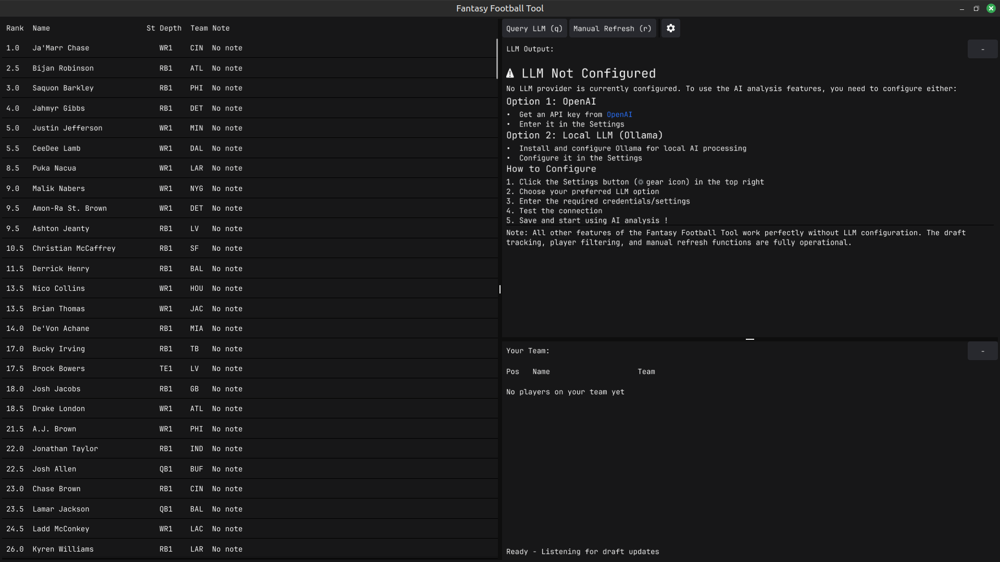

# Fantasy Football Draft Assistant

A draft tool with a note on each player, so you know who you're drafting
even if you don't know the players. Super useful for people like me who
play fantasy football but don't have a clue who anyone is :)

Website: [draftassistant.football](https://draftassistant.football/)

## Repo map

| path | what it is |
|---|---|
| `webapp/` | the draft tool — static web app, deployed to draftassistant.football |
| `site/` | foss.football — weekly rankings, 2026 board, research posts |
| `chrome-extension/` | tracks your live draft and syncs picks into the tool ([Chrome store](https://chromewebstore.google.com/detail/draft-assistant-player-ex/neakbjfmpdmpnibgjeljflnmionbjidi)) |
| `league-sim/` | the stats engine: season + weekly models, league simulator, findings 01–28 |
| `data/` | shared data: `ranks/` board CSVs, `notes/` per-player summaries, `juicebox/` external rankings |
| `reddit-scraper/` | pipeline that turns r/fantasyfootball discussion into the per-player notes |
| `research/` | one-off studies: kicker/DST/injury prediction, opportunity scores, the reddit-notes backtest |
| `archive/` | superseded code — the original Go desktop tool, the 2024 Python tool, season snapshots |
| `build_deploy.py` | rebuilds webapp + site data bundles and assembles `public/` for Cloudflare Pages |
| `update_ranks.py` | refreshes ESPN/Sleeper/FFC market ranks (also runs twice weekly via GitHub Actions) |

`DATA-SOURCES.md` tracks every external data feed and when it was last
fetched — check it before a draft. `SITE_PLAN.md` maps the six planned
products onto the stats engine.

## Generating notes

The note for each player is generated with the scripts in
`reddit-scraper/` — see its README for the season checklist. The finished
notes land in `data/notes/` and are bundled into the webapp by
`webapp/build_data.py`.

## Me vouching for it

In 2024, I came in 2nd in my family league, knowing literally nothing
about football. **13-1** record, just had injuries in the final.

My team was players who were popular on Reddit, and almost all ended up
hitting. It's probably just luck! But it was extremely successful.

12 Team League, pick 6:

- R1: CeeDee Lamb
- R2: Derrick Henry
- R3: Josh Allen
- R4: Josh Jacobs
- R5: Amari Cooper
- R6: Tee Higgins
- R7: Terry McLaurin
- R8: Dalton Kincaid
- R9: Zach Moss
- R10: Chuba Hubbard
- R11: Romeo Doubs
- R12: Adonai Mitchell
- R13: Ray Davis
- R14: Jaylen Wright
- R15: Bears D/ST
- R16: Younghoe Koo

## Defense and Kickers

I exclude defense and kickers from the draft board because
[Subvertadown](https://subvertadown.com/) has excellent rankings to stream
those (and all kickers are pretty much the same). That said, league-sim
findings 27/28 built our own D/ST and kicker weekly models — they power
the weekly view on foss.football.
