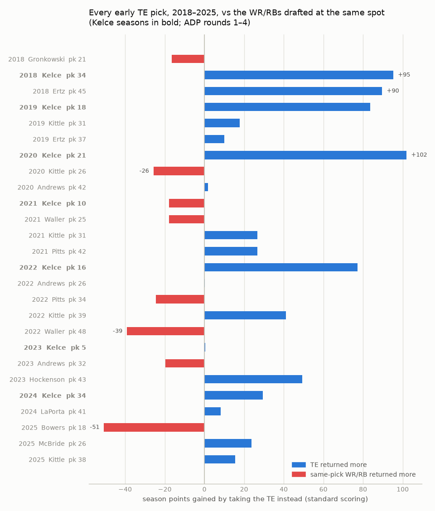
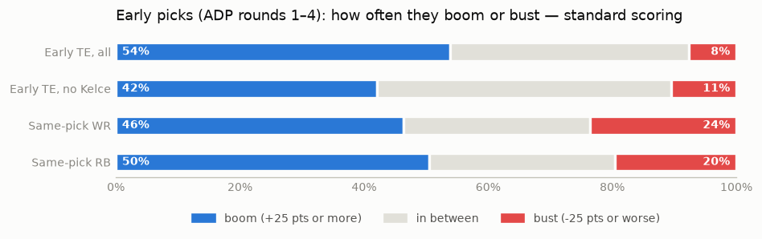
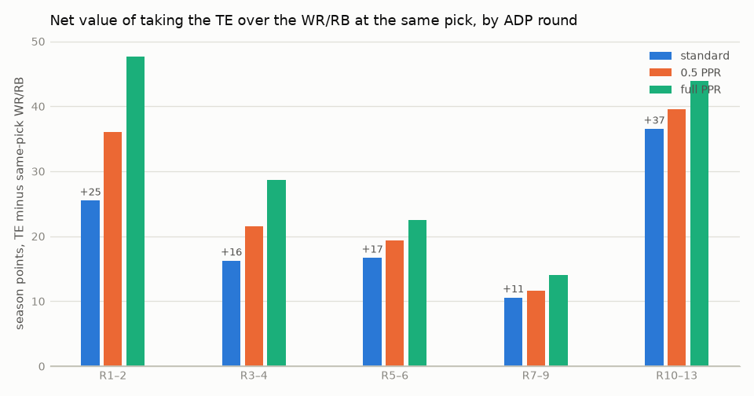
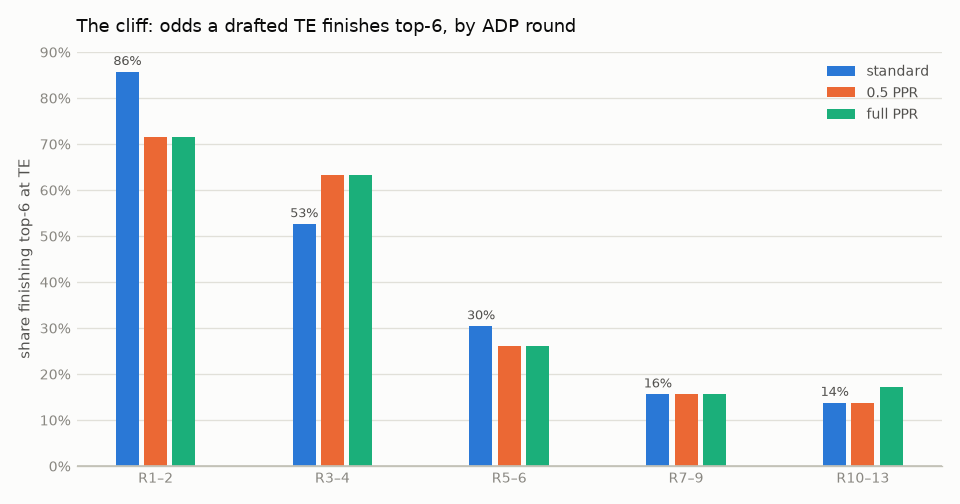

# 33 — Should you draft a TE at all? The same-pick test

**Confidence: Medium-High** for the head-to-head result (consistent
across all three formats and 8 drafts, but 26 early picks concentrated
in a few players). **High** for the hit-rate cliff (n=139, and it
matches finding 29's independent cut).

## TL;DR

Yes, draft one — through one of two doors. The instinct "a WR or RB at
that pick is obviously better than a TE" fails the data: 2018–2025,
the TEs drafted in rounds 1–4 out-returned the WR/RBs taken at the
same picks 69% of the time, and busted at **half** the rate (8% vs
20–24%), because the market only lets two or three heavily-vetted TEs
go early each year while early WR/RBs bust constantly. What *is* true:
the hit odds fall off a cliff after round 4 (86% → 53% → 30% → 16%
top-6), so rounds 5–9 charge a real pick for round-12 odds. Take an
elite TE at cost, or wait until round 10+ — never the middle. The
whole effect scales with receptions: weakest in our standard league,
strongest in full PPR.

## The yardstick (read this first)

To compare a TE season with a WR season you need one currency. Ours:
**season points over the year's last-starter season at the pick's own
position** — TE12 and QB12, RB30 and WR30 by season total (12 teams,
2RB/2WR/flex). Call it "points over the last starter." The logic:
whichever position you *don't* take at this pick, you fill later from
the draft's leftovers, so the difference between the TE's number and
the same-slot WR/RB's number is the season points your lineup actually
gained or lost by the choice.

One reading note: **lower is worse.** In the charts below, a WR/RB
group sitting below the TE means those picks returned less — not that
you should have taken them.

## 1. Every early TE vs the WR/RBs at his pick

For each TE drafted in ADP rounds 1–4 (26 picks in eight drafts),
compare his points-over-last-starter to the average of every WR/RB
drafted within ±6 picks of his ADP:

| | std | half | PPR |
|---|---|---|---|
| TE beat the same-slot WR/RB mean | 18/26 (69%) | 18/26 (69%) | 17/26 (65%) |
| net season pts per pick, all 26 | +19 | +25 | +34 |
| …Kelce's 7 seasons only | +77 | +99 | +121 |
| …ex-Kelce (19 picks) | +6 | +9 | +13 |
| ex-Kelce win rate | 12/19 (63%) | 12/19 (63%) | 11/19 (58%) |

So the honest split: a big chunk of "early TE pays" is the Kelce era —
but even with him removed, the early TE was a *slightly better* use of
the pick than the same-slot WR/RB, in every format. Never worse. The
2025 rows preview the post-Kelce version: Bowers at pick 18 lost to
his slot by 51, McBride at 26 beat his by 24, Kittle at 38 by 16.

## 2. Boom or bust — why the TE keeps winning the trade

The mechanism isn't that early TEs boom more. It's that they almost
never crater:

Standard scoring, early picks (rounds 1–4); boom = 25+ points over the
last-starter season, bust = 25 under:

| group | n | boom | in between | bust |
|---|---|---|---|---|
| Early TE, all | 26 | 54% | 38% | 8% |
| Early TE, no Kelce | 19 | 42% | 47% | 11% |
| Same-pick WR | 110 | 46% | 30% | 24% |
| Same-pick RB | 107 | 50% | 30% | 20% |

Comparable boom rates, one-half to one-third the bust rate. Eight
drafts produced exactly two early-TE wipeouts (Pitts 2022, Waller
2022) against dozens of round-2-3 WR/RB zeroes. The market drafts
15-plus WR/RBs in the first four rounds and two or three TEs; the TEs
it lets through that filter are the position's sure things.

## 3. When: the net value by round…

| ADP band | n TEs | std | half | PPR |
|---|---|---|---|---|
| R1–2 | 7 | +25 | +36 | +48 |
| R3–4 | 19 | +16 | +21 | +29 |
| R5–6 | 23 | +17 | +19 | +23 |
| R7–9 | 32 | +11 | +12 | +14 |
| R10–13 | 58 | +37 | +40 | +44 |

Positive everywhere — a drafted TE has beaten the WR/RBs at his slot
in every band, and round 10+ is the best cell on the board. Two
warnings before over-reading the middle rows, both ways this yardstick
flatters a TE pick: a dead TE pick "only" costs the TE12 baseline
(~80 pts) while a dead RB pick costs the RB30 baseline (~110), and the
yardstick gives the WR/RB no credit for bench value — a WR35 season
still fills your flex in bye weeks; a TE9 season is a cut. The middle
bands' +11-to-+17 is well inside what those two biases can manufacture.
The R1–4 and R10+ numbers are too big for that excuse.

## 4. …and the cliff that rules out the middle

| ADP band | n | top-3 (std) | top-6 (std) | outside top-12 (std) |
|---|---|---|---|---|
| R1–2 | 7 | 71% | 86% | 0% |
| R3–4 | 19 | 32% | 53% | 21% |
| R5–6 | 23 | 22% | 30% | 52% |
| R7–9 | 32 | 0% | 16% | 59% |
| R10–13 | 58 | 7% | 14% | 64% |

(Half/PPR within a few points everywhere — the cliff is
format-proof.) Past round 6, TE ADP carries almost no information: a
round-7 TE and a round-12 TE are the same lottery ticket at different
prices. That is what kills the middle: the round 5–9 TE offers
round-12 odds at a round-5-to-9 price, and the modest same-pick edge
in section 3 doesn't cover walking out of the meat of the draft with a
52-to-64%-chance non-starter as your only TE. Hence the two doors:

1. **Elite door** — one of the ~2-3 consensus elite TEs at market
   price, rounds 1–4. Historically fine-to-good; best of all in PPR.
2. **Wait door** — nothing until round 10+, ideally two darts or a
   streaming plan (finding 05). Best net value per pick; 1-in-7
   top-6 odds per dart, so the plan matters more than the name.
3. **Never the hallway between** (rounds 5–9).

And yes, actually draft one: the live-off-the-wire punt is drying up —
undrafted top-8 TEs went 3, 2, 3 in 2020–22, then 0, 1, 0 in 2023–25
(finding 05) — and punting your only TE to round 10 with no streaming
plan measured −1.42 all-play in the sim (finding 20).

## 5. The format dial

Every TE number above grows from std → half → PPR while the same-pick
WR/RB alternative doesn't keep pace (elite TEs are 90-catch players;
TE12 catches ~50): the all-26 net goes +19 → +25 → +34, ex-Kelce +6 →
+9 → +13, the R1–2 band +25 → +36 → +48. Rule of thumb: in full PPR,
move the elite TEs up about half a round to a round from where you'd
slot them in standard; in our standard family league the elite door is
at its least valuable — real, but a luxury, not a priority.

## 2026 read (where the market put the doors)

Prices from the ADP snapshot the draft tool ships (Sleeper where
available, FFC as fallback; fetched 2026-08-03), by scoring format:

| TE | std | half | PPR | door |
|---|---|---|---|---|
| Trey McBride | 23 | 18 | 16 | **elite** |
| Brock Bowers | 30 | 19 | 21 | **elite** |
| Colston Loveland | 51 | 44 | 41 | hallway |
| Tyler Warren | 59 | 51 | 50 | hallway |
| Harold Fannin | 66 | 68 | 61 | hallway |
| Tucker Kraft | 76 | 69 | 66 | hallway |
| Kyle Pitts | 78 | 75 | 71 | hallway |
| Sam LaPorta | 85 | 79 | 76 | hallway |
| Kincaid · Gadsden · Henry · Goedert · Andrews · Ferguson | 87–105 | | | hallway |
| George Kittle | 109 | 100 | 97 | **wait** |

The elite door in 2026 is exactly two players, and it is genuinely
early — McBride in round 2, Bowers in round 3, both inside the top 21
picks once receptions count. Then thirteen tight ends are priced from
pick 51 to pick 105: that entire block is the hallway this finding
says not to buy. The wait door opens around Kittle at 109.

So the 2026 decision is unusually clean: take McBride or Bowers at
their price if you want the elite door, and if you miss both, take
nothing at the position until round 10 and plan to stream. Note this
is a two-day-old snapshot of a market that moves through August —
re-check before the draft rather than trusting these exact numbers.

(An earlier draft of this section ranked 2026 tight ends by the
projection model's predicted PPG and flagged where the model
out-ranked the market. [Finding 32](32-draft-sim.md) settled that the
model belongs nowhere near list order — every step from ADP toward it
made drafting worse — and the site retired the board, so this section
is market-only.)

## Methodology

- ADP boards `data/adp_2018..2025.json` (FFC 12-team), matched to
  gsis ids via season rosters (same matching as finding 29); every
  drafted QB/RB/WR/TE, n=1,352.
- Scoring: league-exact per-category floors (`player_model.league_pts`)
  with the reception knob at 0 / 0.5 / 1.0; weeks 1–17.
- A drafted player with no NFL season scores 0 (busts count, injuries
  count). Finishes are by season total, as in finding 29.
- "Same pick" = WR/RBs with ADP within ±6 overall picks, same draft.
- Reproduce: `venv/bin/python analysis/te_same_pick.py` (prints every
  table above and writes the four `figures/te_*.png`).

## Caveats

- 26 early-TE picks is a small sample carried by few players: Kelce 7,
  Kittle 5, Andrews 3, Ertz 2, Pitts 2, Waller 2. "The market vets
  early TEs well" rests on roughly ten distinct careers, and a
  Kelce-grade eight-year run may simply not exist in the next window.
- The yardstick's two pro-TE biases (bust-floor asymmetry, no bench
  credit) are argued in section 3; they cloud the middle bands, not
  the early rounds or the cliff.
- One ADP board serves all three formats; real half/PPR rooms draft
  TEs and WRs slightly earlier, which would shave the half/PPR edges
  somewhat.
- ±6 picks is one window; spot checks at ±4 and ±10 move means a few
  points without changing any sign.
- None of this measures the weekly start/sit convenience of an elite
  TE (never streaming, never sweating waivers) — that's real but
  unpriced here.
